# 用 docker 部署 JIRA 和 Confluence（破解版）


### 数据库

如果是选择外部数据库，大家可以按照这样创建：

```sql
# 创建jira数据库及用户
CREATE DATABASE jiradb CHARACTER SET utf8mb4 COLLATE utf8mb4_bin;
grant all on jiradb.* to 'jirauser'@'%' identified by 'tVxxxb6n';

# 创建confluence数据库及用户
CREATE DATABASE confdb CHARACTER SET utf8mb4 COLLATE utf8mb4_bin;
grant all on confdb.* to 'confuser'@'%' identified by '7FxxxzhO';

# confluence要求设置事务级别为READ-COMMITTED
set global tx_isolation='READ-COMMITTED';
```


## 安装 JIRA(8.8.1)

JIRA 是一个缺陷跟踪管理系统，为针对缺陷管理、任务追踪和项目管理的商业性应用软件，开发者是澳大利亚的Atlassian。JIRA这个名字并不是一个缩写，而是截取自“Gojira”，日文的哥斯拉发音。 [官网](https://www.atlassian.com/software/jira)

### 制作Docker破解容器

编写`Dockerfile`文件：

```dockerfile
FROM cptactionhank/atlassian-jira-software:latest

USER root

# 将代理破解包加入容器
COPY "atlassian-agent.jar" /opt/atlassian/jira/

# 设置启动加载代理包
RUN echo 'export CATALINA_OPTS="-javaagent:/opt/atlassian/jira/atlassian-agent.jar ${CATALINA_OPTS}"' >> /opt/atlassian
```

### 构建镜像

```shell
cd jira
docker build -t jira-software:8.8.1 .
```

### 启动容器

```shell
cd jira
docker-compose up -d
```

### 访问 jira

访问 IP:8080，选择语言并选择手动配置

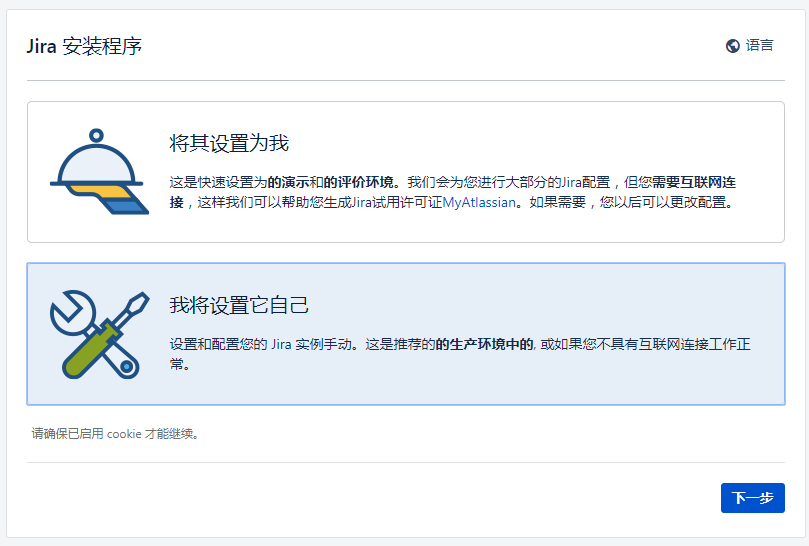

演示使用内置数据库（生产环境需配置独立数据库）：


设置属性

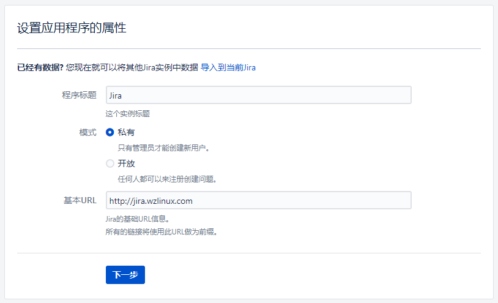

### 破解

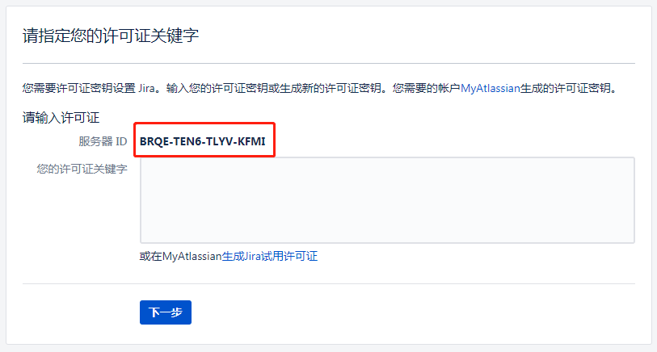

1. 复制服务器ID: **BRQE-TEN6-TLYV-KFMI**
2. 在本地存放`atlassian-agent.jar`的目录下执行命令，生成许可证：
3. 需替换邮箱（test@test.com）、名称（BAT）、访问地址（[http://192.168.0.89）、服务器ID（BY9B-GWD1-1C78-K2DE）为你的信息](http://192.168.0.89）、服务器ID（BY9B-GWD1-1C78-K2DE）为你的信息/)

```shell
java -jar atlassian-agent.jar \
  -d -m test@test.com -n BAT \
  -p jira -o http://192.168.0.89 \
  -s BY9B-GWD1-1C78-K2DE
```

例如我的信息如下，生成许可证：

```bash
java -jar atlassian-agent.jar \
  -d -m wangzan18@126.com -n BAT \
  -p jira -o http://jira.wzlinux.com \
  -s BRQE-TEN6-TLYV-KFMI

====================================================
=======        Atlassian Crack Agent         =======
=======           https://zhile.io           =======
=======          QQ Group: 30347511          =======
====================================================

Your license code(Don't copy this line!!!): 

AAABoQ0ODAoPeJx9ktFPqzAUxt/5K0h8LpaazbmE5CrUhAhMB5rcx46dbTWskNMynX+9Hcy467wkv
LSn5/vO+X1c5K1yU7F3fer6bEpHU8rcMC9cRhl1XiUKr8F62ZbGOxyIrlfmTSB4ojRyB4HBFpxUS
GVACVUCf28k7iNhIGB0ckPotf2GdLJ2uwCcrZ41oA6I37+1AiIEK4q9Qw64A4yj4G7+xEnBszEpk
r8v5OE+jZ1ElqA02GoSRznPSOKPJjd0cjWi7HrsO2GtjB2X2zGr4E2o9YdQ/uSPz8ZeWW97w9N1+
E5UrTCyVsFKVBqcxxbLjdBwXItRQkfEp1/Gxb6BTGwhCGdpyudhfJs4awRQm7ppAP/R7swG+rr6G
ZNjw+9wz16feg9YRaBLlE2357Oq5FYaWLpV3+Au9u7GmEZPLy8/NrICT9ZDMeZG4CGtHtiReOd4d
1s4M1wLJXXP9CBrVTsxyx/trVrrLgobXvBbgAhd60/+ebv4XuEML1/KfrcsidO44NHQ/D9/uFOG3
XWDUsN57b9eR44vNpNDgX0C7gEsJDAsAhQGL/A02nteG056fiVCh12XIgz+KwIUG3z2e35ugE7Pc
N6ZMj+Aum9LTK8=X02k4
```

将生成的许可证复制到页面，完成破解。

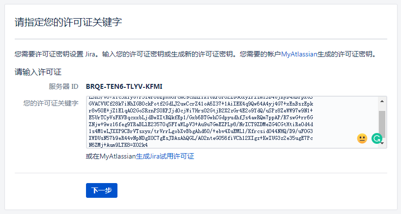

查看许可结果

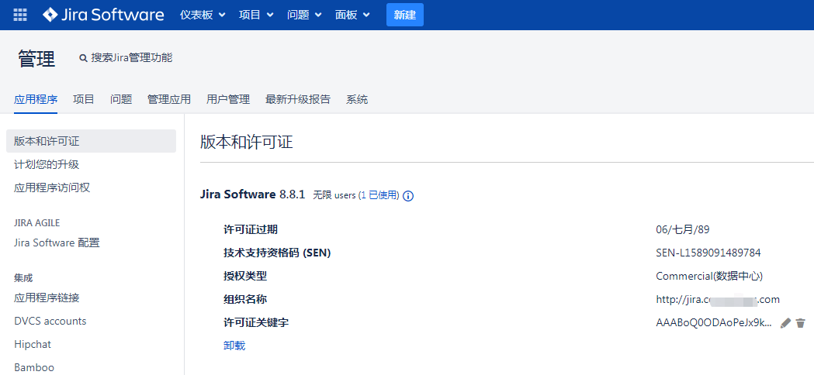

## 安装 Confluence(7.4.0)

Atlassian Confluence（简称Confluence）是一个专业的wiki程序。它是一个知识管理的工具，通过它可以实现团队成员之间的协作和知识共享。[官网](https://www.atlassian.com/software/confluence)

### 编写Dockerfile文件：

```dockerfile
FROM cptactionhank/atlassian-confluence:latest

USER root

# 将代理破解包加入容器
COPY "atlassian-agent.jar" /opt/atlassian/confluence/

# 设置启动加载代理包
RUN echo 'export CATALINA_OPTS="-javaagent:/opt/atlassian/confluence/atlassian-agent.jar ${CATALINA_OPTS}"
```

### 构建镜像

```shell
cd confluence
docker build -t confluence:7.4.0 .
```

### 启动容器

```
cd confluence
docker-compose up -d
```

### 访问 confluence

访问 IP:8090，参照JIRA的安装流程，进行操作。可在引导过程中，与之前安装的JIRA进行绑定关联。


我们就选择一个应用吧

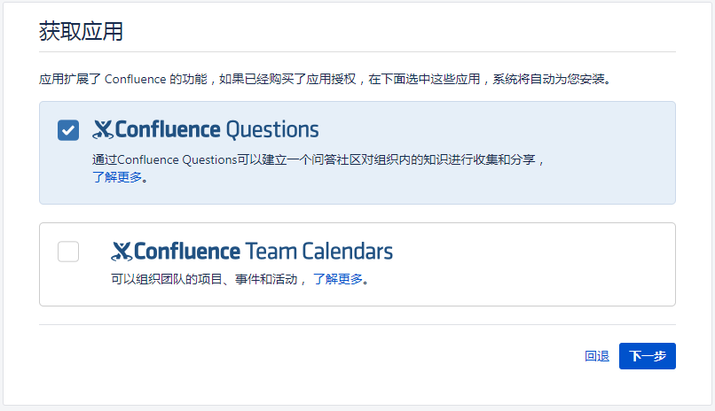

### 破解

生成confluence许可命令参照如下：

```shell
# 设置产品类型：-p conf， 详情可执行：java -jar atlassian-agent.jar 
java -jar atlassian-agent.jar -d -m test@test.com -n BAT -p conf -o http://192.168.0.89 -s BY9B-GWD1-1C78-K2DE
java -jar atlassian-agent.jar \
  -d -m wangzan18@126.com -n BAT \
  -p conf -o http://confluence.wzlinux.com \
  -s BTW4-2T4Y-9BTK-R0DP

====================================================
=======        Atlassian Crack Agent         =======
=======           https://zhile.io           =======
=======          QQ Group: 30347511          =======
====================================================

Your license code(Don't copy this line!!!): 

AAABXQ0ODAoPeJx1kV9vgjAUxd/7KUj2XG1R5p+EZArEmYEsotteK7tqEyikLW7s069UzJJlS/rQn
HtPf/fc3mWNcBLWOpQ41JuT6dylTpDtHJe4BCWMCw2CiRyiz5rLNmQafJdMZ5hMzEExz0Gof4ohq
FzyWvNK+HtR8JJreHeKq8U5tM5Z61rNh8OvMy9gwCsUVEKzXG9YCf5ysUMZyAvIdegvR49jHNL0F
a+25A0/Be4K5ZU4DjZNeQCZHvcKpPIxRak8McEVs9QOYN7vOosGTIpBXpXS1MRJddcbMDJBC/+Di
dMXE3T6QN17W7aIPuOurcEOFqRJEm2D9SJGgQQL6pO7BBMPU3Jbixk8XodZtMEx9aYzMht7hI4mH
jKS/4dscWYcfgFfywZQdGFFc41yZIUC9NzI/MwU/AZmzeFn19Zq38o0kxpkb7aScbIARKfavv47X
sz6Oq/7DWevrTUwLgIVAIEyoNFjmUFyTJOVUzmxTJTM14S8AhUAkaRbRjdl4D9MZtO6l5nCHcR2B
80=X02h9
```

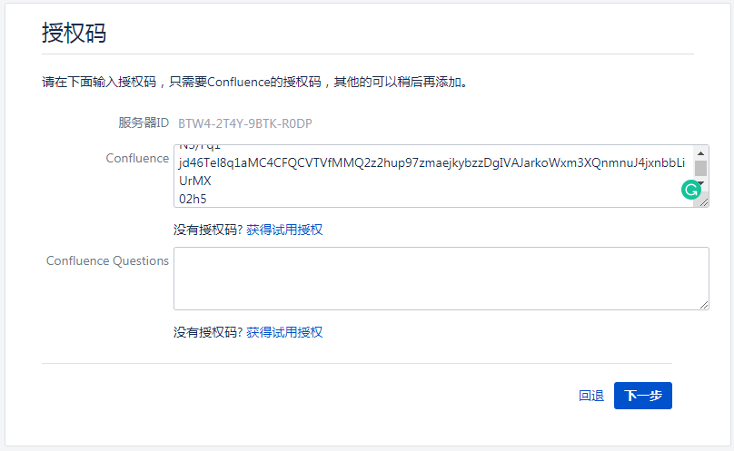

选择单机模式，并设置数据库

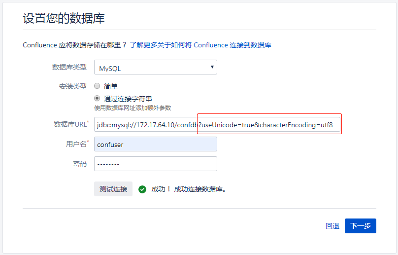

### 配置 confluence

我们做个示范站点

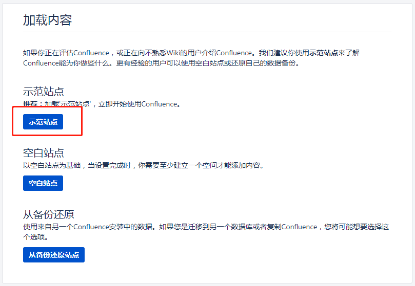

配置用户管理，这里我们选择之前创建好的 jira

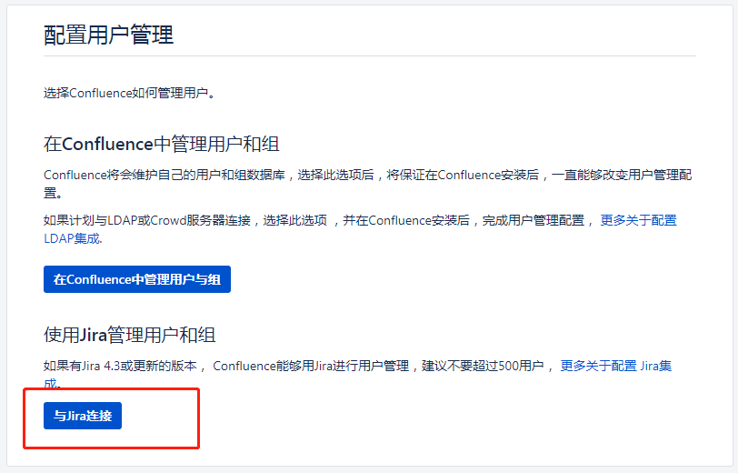

配置连接信息

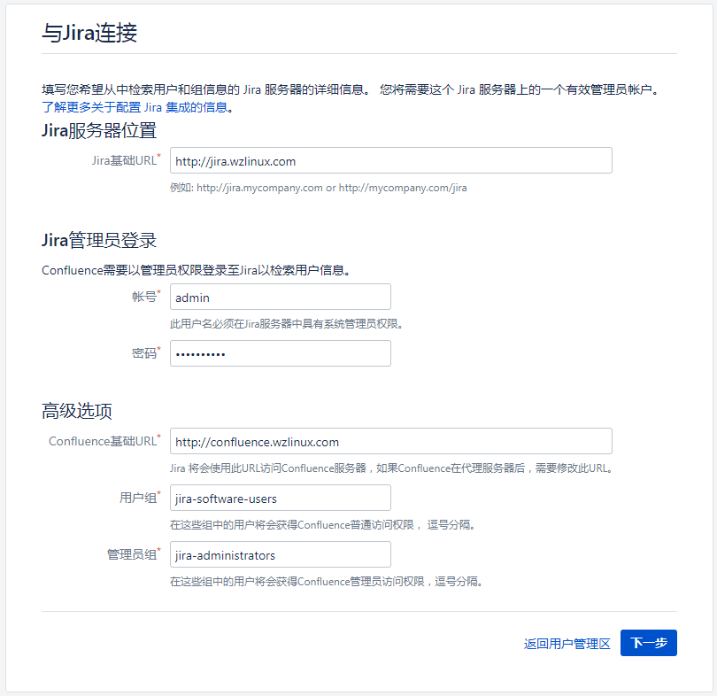

同步数据

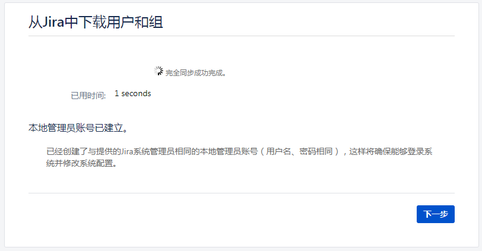

大功告成


登陆查看授权情况

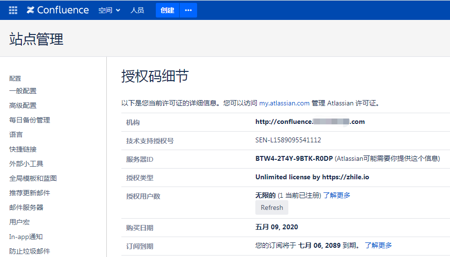

## 乱码问题

在我们正常安装之后，中文可能会有乱码，我们修改一下连接字符串，在 confluence 的家目录下面，有一个配置文件`confluence.cfg.xml`，找到`hibernate.connection.url`，在数据库字符串后面加上如下字符，整体结果如下：

```xml
jdbc:mysql://172.17.64.10/confdb?useUnicode=true&characterEncoding=utf8
```

记住，里面的`amp;`不要省略。

如果可以的话，把数据库的字符串改成`utf8mb4`
